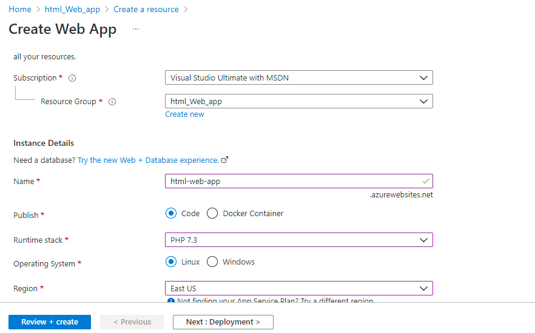
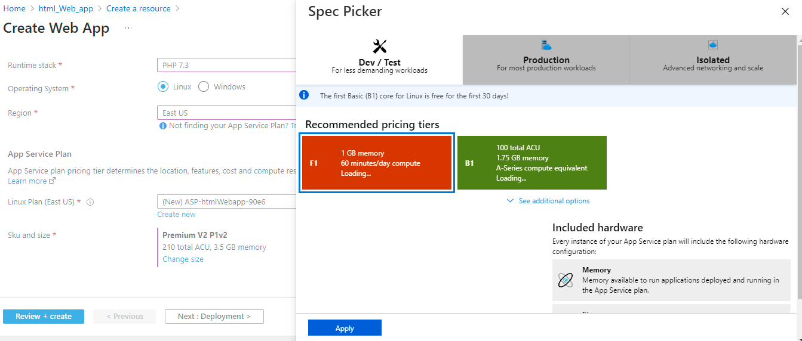
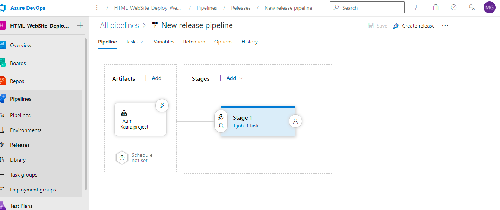
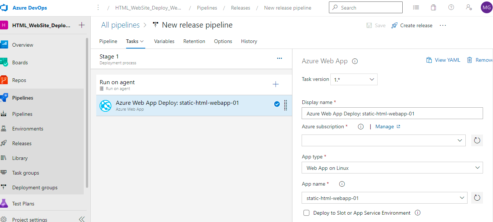

## Deploy Static HTML Website Azure Web App
This Repo gives you an idea of how to deploy static html website using Azure Devops

| Language | Platform | Author |
| -------- | --------|--------|
| HTML |  Azure Web App, Virtual Machine| Mohit Gupta

## Create Web App 
Create Azure Web App on Azure Portal 



Choose service plan



## Check-in Source Code at GitHub

select any Sample HTML/CSS web app . check-in code on githib 

## Create Azure DevOps Pipeline

This pipeline publish artifacts to release pipeline 

```
# HTML
# Archive your static HTML project and save it with the build record.
# Add steps that build, run tests, deploy, and more:
# https://aka.ms/yaml

trigger:
- master

pool:
  vmImage: ubuntu-latest

steps:
- task: ArchiveFiles@2
  inputs:
    rootFolderOrFile: '$(build.sourcesDirectory)'
    includeRootFolder: false
- task: PublishBuildArtifacts@1

```

## Create Azure DevOps Release Pipeline





## Deploy App

Run Pipeline and Deploy App to Azure 

